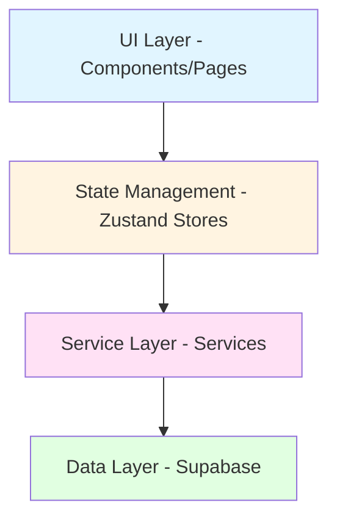
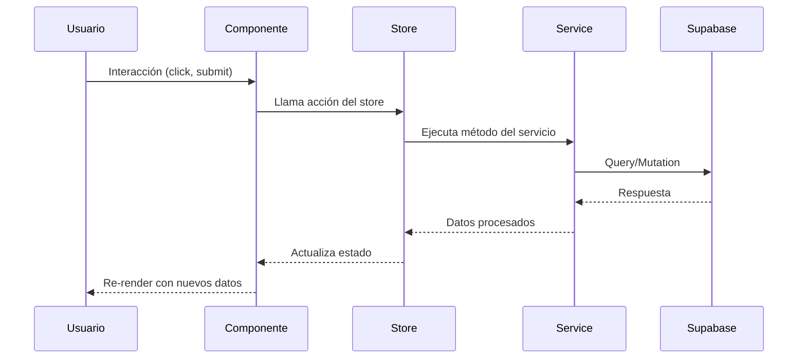

# Manual Completo - Plataforma Filadelfia React

## Parte 1: Introducción y Arquitectura General

---

## 📋 Tabla de Contenidos

1. [Introducción](#introducción)
2. [Stack Tecnológico](#stack-tecnológico)
3. [Estructura del Proyecto](#estructura-del-proyecto)
4. [Arquitectura General](#arquitectura-general)
5. [Configuración Inicial](#configuración-inicial)

---

## 1. Introducción

La **Plataforma Filadelfia** es una aplicación web de gestión administrativa desarrollada con React y TypeScript. Permite gestionar:

- **Personas**: Registro y seguimiento de miembros
- **Transacciones**: Control de ingresos y egresos
- **Actividades**: Planificación y seguimiento de eventos
- **Categorías**: Clasificación de transacciones
- **Sedes**: Gestión de múltiples ubicaciones
- **Usuarios**: Control de acceso y permisos
- **Reportes**: Análisis y visualización de datos

### Características Principales

✅ **Autenticación segura** con roles (Admin, Usuario, Contador)  
✅ **Gestión de estado** con Zustand  
✅ **Base de datos** Supabase (PostgreSQL)  
✅ **Interfaz moderna** con TailwindCSS  
✅ **Exportación** de datos a PDF y Excel  
✅ **Gráficos interactivos** con Recharts  
✅ **Validación de formularios** con React Hook Form y Zod  
✅ **Lazy loading** para optimización de rendimiento  

---

## 2. Stack Tecnológico

### Frontend Core

| Tecnología | Versión | Propósito |
|------------|---------|-----------|
| **React** | 19.1.1 | Framework UI principal |
| **TypeScript** | 5.9.3 | Tipado estático |
| **Vite** | 7.1.7 | Build tool y dev server |
| **React Router DOM** | 7.9.5 | Enrutamiento |

### Gestión de Estado

| Tecnología | Versión | Propósito |
|------------|---------|-----------|
| **Zustand** | 5.0.8 | State management global |
| **React Hook Form** | 7.66.0 | Gestión de formularios |
| **Zod** | 4.1.12 | Validación de esquemas |

### Backend y Base de Datos

| Tecnología | Versión | Propósito |
|------------|---------|-----------|
| **Supabase** | 2.81.1 | Backend as a Service (BaaS) |
| **PostgreSQL** | - | Base de datos (via Supabase) |

### UI y Estilos

| Tecnología | Versión | Propósito |
|------------|---------|-----------|
| **TailwindCSS** | 3.4.18 | Framework CSS utility-first |
| **Lucide React** | 0.552.0 | Iconos |
| **Recharts** | 3.3.0 | Gráficos y visualizaciones |

### Utilidades

| Tecnología | Versión | Propósito |
|------------|---------|-----------|
| **date-fns** | 4.1.0 | Manipulación de fechas |
| **jsPDF** | 3.0.4 | Generación de PDFs |
| **xlsx** | 0.18.5 | Exportación a Excel |
| **qrcode** | 1.5.4 | Generación de códigos QR |
| **browser-image-compression** | 2.0.2 | Compresión de imágenes |

---

## 3. Estructura del Proyecto

```
filadelfia-react/
│
├── public/                      # Archivos estáticos
│
├── src/
│   ├── assets/                  # Recursos (imágenes, fuentes)
│   │
│   ├── components/              # Componentes reutilizables
│   │   ├── actividades/         # Componentes de actividades
│   │   ├── auth/                # Componentes de autenticación
│   │   ├── categorias/          # Componentes de categorías
│   │   ├── charts/              # Gráficos y visualizaciones
│   │   ├── common/              # Componentes comunes
│   │   ├── layout/              # Componentes de layout
│   │   ├── personas/            # Componentes de personas
│   │   ├── reportes/            # Componentes de reportes
│   │   ├── sedes/               # Componentes de sedes
│   │   ├── transacciones/       # Componentes de transacciones
│   │   ├── ui/                  # Componentes UI base
│   │   └── usuarios/            # Componentes de usuarios
│   │
│   ├── config/                  # Configuraciones
│   │   ├── routes.tsx           # Definición de rutas
│   │   └── supabase.ts          # Cliente Supabase
│   │
│   ├── data/                    # Datos estáticos
│   │
│   ├── hooks/                   # Custom hooks
│   │
│   ├── lib/                     # Librerías y utilidades
│   │   └── supabase.ts          # Cliente principal Supabase
│   │
│   ├── pages/                   # Páginas de la aplicación
│   │   ├── HomePage.tsx
│   │   ├── LoginPage.tsx
│   │   ├── DashboardPage.tsx
│   │   ├── PersonasPage.tsx
│   │   ├── TransaccionesPage.tsx
│   │   ├── ActividadesPage.tsx
│   │   ├── CategoriasPage.tsx
│   │   ├── ReportesPage.tsx
│   │   ├── UsuariosPage.tsx
│   │   └── SedesPage.tsx
│   │
│   ├── services/                # Servicios de API
│   │   ├── auth.service.ts
│   │   ├── personas.service.ts
│   │   ├── transacciones.service.ts
│   │   ├── actividades.service.ts
│   │   ├── categorias.services.ts
│   │   ├── sedes.service.ts
│   │   ├── storage.service.ts
│   │   └── export.service.ts
│   │
│   ├── stores/                  # Stores de Zustand
│   │   ├── auth.store.ts
│   │   ├── personas.store.ts
│   │   ├── transacciones.store.ts
│   │   ├── actividades.store.ts
│   │   └── categorias.store.ts
│   │
│   ├── types/                   # Definiciones de tipos
│   │
│   ├── utils/                   # Funciones utilitarias
│   │
│   ├── App.tsx                  # Componente raíz
│   ├── main.tsx                 # Punto de entrada
│   └── index.css                # Estilos globales
│
├── .env                         # Variables de entorno
├── package.json                 # Dependencias
├── tsconfig.json                # Configuración TypeScript
├── vite.config.ts               # Configuración Vite
└── tailwind.config.js           # Configuración Tailwind

```

### Explicación de Carpetas Principales

#### 📁 **components/**
Contiene todos los componentes React organizados por dominio. Cada subcarpeta agrupa componentes relacionados con una funcionalidad específica.

#### 📁 **services/**
Capa de servicios que encapsula toda la lógica de comunicación con Supabase. Cada servicio maneja las operaciones CRUD de una entidad específica.

#### 📁 **stores/**
Stores de Zustand para gestión de estado global. Cada store maneja el estado de una entidad y sus operaciones.

#### 📁 **pages/**
Componentes de página que representan rutas completas. Utilizan lazy loading para optimización.

#### 📁 **config/**
Archivos de configuración como rutas y cliente de Supabase.

#### 📁 **types/**
Definiciones de tipos TypeScript compartidos en toda la aplicación.

---

## 4. Arquitectura General

### 4.1 Patrón de Arquitectura

La aplicación sigue una **arquitectura en capas** con separación de responsabilidades:



#### **Capa 1: UI (Presentación)**
- **Componentes** y **Páginas**
- Responsable de renderizar la interfaz
- Consume datos de los stores
- Dispara acciones del usuario

#### **Capa 2: Gestión de Estado**
- **Zustand Stores**
- Mantiene el estado global de la aplicación
- Proporciona acciones para modificar el estado
- Persiste datos en localStorage cuando es necesario

#### **Capa 3: Servicios**
- **Services**
- Encapsula la lógica de negocio
- Realiza llamadas a la API de Supabase
- Maneja errores y transformaciones de datos

#### **Capa 4: Datos**
- **Supabase (PostgreSQL)**
- Almacenamiento persistente
- Autenticación y autorización
- Storage para archivos

### 4.2 Flujo de Datos



### 4.3 Gestión de Estado con Zustand

**Zustand** es una librería minimalista de gestión de estado. A diferencia de Redux, no requiere boilerplate excesivo.

#### Ventajas de Zustand:
- ✅ API simple y directa
- ✅ Sin providers ni context
- ✅ TypeScript-friendly
- ✅ Middleware de persistencia integrado
- ✅ Rendimiento optimizado

#### Ejemplo de Store:

```typescript
import { create } from 'zustand'
import { persist } from 'zustand/middleware'

interface AuthStore {
  user: User | null
  token: string | null
  isAuthenticated: boolean
  
  setUser: (user: User | null) => void
  logout: () => void
}

export const useAuthStore = create<AuthStore>()(
  persist(
    (set) => ({
      user: null,
      token: null,
      isAuthenticated: false,
      
      setUser: (user) => set({ 
        user, 
        isAuthenticated: user !== null 
      }),
      
      logout: () => set({ 
        user: null, 
        token: null, 
        isAuthenticated: false 
      }),
    }),
    {
      name: 'auth-store', // Nombre en localStorage
      partialize: (state) => ({ 
        user: state.user,
        token: state.token,
        isAuthenticated: state.isAuthenticated
      }),
    }
  )
)
```

### 4.4 Integración con Supabase

**Supabase** es un Backend as a Service (BaaS) que proporciona:

- 🔐 **Autenticación**: Sistema completo de auth con JWT
- 💾 **Base de datos**: PostgreSQL con API REST automática
- 📦 **Storage**: Almacenamiento de archivos
- 🔄 **Realtime**: Subscripciones a cambios en tiempo real
- 🔒 **Row Level Security (RLS)**: Seguridad a nivel de fila

#### Configuración del Cliente:

```typescript
// src/lib/supabase.ts
import { createClient } from '@supabase/supabase-js'

const supabaseUrl = import.meta.env.VITE_SUPABASE_URL
const supabaseAnonKey = import.meta.env.VITE_SUPABASE_ANON_KEY

export const supabase = createClient(supabaseUrl, supabaseAnonKey)
```

#### Variables de Entorno (.env):

```env
VITE_SUPABASE_URL=https://tu-proyecto.supabase.co
VITE_SUPABASE_ANON_KEY=tu-anon-key
```

---

## 5. Configuración Inicial

### 5.1 Instalación

```bash
# Clonar repositorio
git clone <repository-url>

# Instalar dependencias
npm install

# Configurar variables de entorno
cp .env.example .env
# Editar .env con tus credenciales de Supabase
```

### 5.2 Scripts Disponibles

```json
{
  "dev": "vite",                    // Servidor de desarrollo
  "build": "tsc -b && vite build",  // Build de producción
  "lint": "eslint .",               // Linter
  "preview": "vite preview"         // Preview del build
}
```

### 5.3 Ejecución

```bash
# Desarrollo
npm run dev
# La app estará disponible en http://localhost:5173

# Producción
npm run build
npm run preview
```

### 5.4 Estructura de Base de Datos

La aplicación utiliza las siguientes tablas principales en Supabase:

- **profiles**: Perfiles de usuario (extiende auth.users)
- **sedes**: Sedes de la organización
- **personas**: Registro de miembros
- **categorias**: Categorías de transacciones
- **actividades**: Actividades y eventos
- **transacciones**: Transacciones financieras
- **ministerios**: Ministerios de la iglesia
- **escalas**: Escalas de servicio

---

## 📌 Resumen Parte 1

En esta primera parte hemos cubierto:

✅ Introducción y características de la plataforma  
✅ Stack tecnológico completo  
✅ Estructura detallada del proyecto  
✅ Arquitectura en capas  
✅ Flujo de datos  
✅ Gestión de estado con Zustand  
✅ Integración con Supabase  
✅ Configuración inicial  

---

**Continúa en:** [Parte 2 - Servicios y Persistencia de Datos](./MANUAL_PARTE_2.md)
